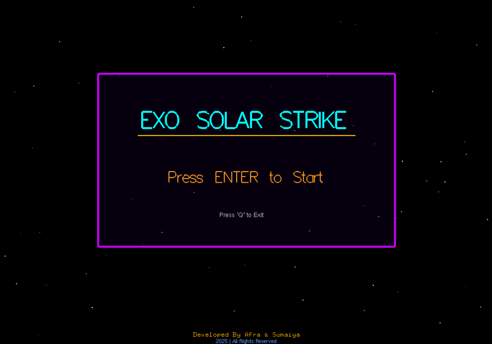

---

# Exo Solar Strike - 3D Celestial Simulation & Game

**Exo Solar Strike** is a comprehensive, interactive 3D application developed using C++ and the OpenGL framework. This project serves as a bridge between celestial simulation and interactive gaming, offering users a multi-dimensional experience. It allows users to explore the vastness of the solar system, learn about planetary bodies through a digital encyclopedia, and test their reflexes in a high-octane asteroid survival game.

